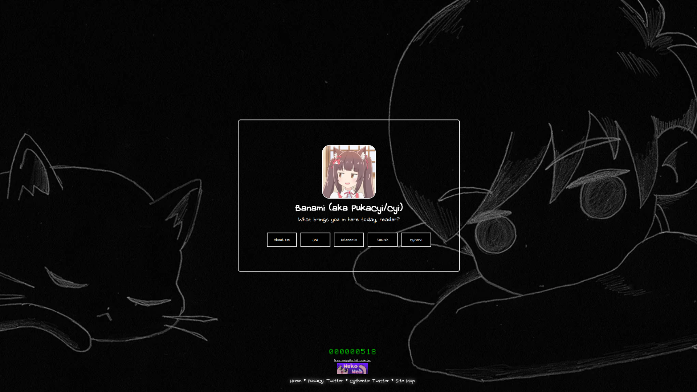

# Banami | Nekoweb

This is the public source code for the website 'banami.nekoweb.org,' which I operate (@PukaCyi). Keep in mind that this repository may not be regularly updated and may not reflect the current version that's displayed on the site.

# What's Nekoweb?
Nekoweb is a free static web hosting service created by D1mden and the team behind Nekoweb. It works almost precisely like Neocities and comes with other features, such as terminals and "nice links" (which don't include file extensions at the end of pages.) Check out Nekoweb when possible :3

# Credits and others
* [Myself](https://banami.nekoweb.org/banami) (for existing and staring at the screen in utter frustration as I type this and other things relevant to the repo code.)
* OMOCAT (the org.): Mewo background, dialogue/buttons, White Space piano song, pretty much everything that uses Omori stuff
* d1mden + Nekoweb Team (for the awesome website, luv nekoweb, nekoweb forever)
* ghost and pals for keeping me sane (I think I've listened to like 60% of their songs, at least on Spotify - mainly consisting of "Reckless Battery Burns" and "Pathological Facade" on repeat)
